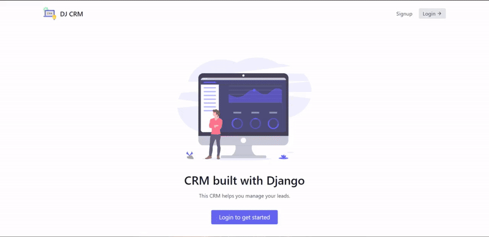

# Admin Dashboard (Django & Reactjs)

Develop a comprehensive CRM (Customer Relationship Management) System using Django, incorporating essential features such as a login and sign-up page with robust authentication mechanisms and role-based permissions. The system facilitates access control, allowing specific roles to access designated information.

Upon login, users can authenticate themselves as either an admin or an agent. The admin role encompasses privileges such as creating, editing, deleting, and updating agents, leads, and categories (e.g., converted, unconverted). Agents, on the other hand, are restricted to viewing leads assigned to them.

The system provides an overview dashboard, displaying key metrics such as the number of assigned and unassigned leads, specifically tailored for admin users. Additionally, upon the creation of a new agent by the admin, an automated email notification is triggered, providing the newly appointed agent with instructions to set up their account, including a password reset procedure.

The primary objective of this system is to facilitate a deeper understanding of intermediate-level Django features, particularly in designing and implementing authentication, permissions, and other essential functionalities.

## Demo

## Authors

- [@mattfreire](https://github.com/justdjango/getting-started-with-django) (Reference source code )

- https://www.youtube.com/@mattfreire (also check his youtube channel)

## Acknowledgements

- [Follow for more like this on youtube ](https://www.youtube.com/@mattfreire)
